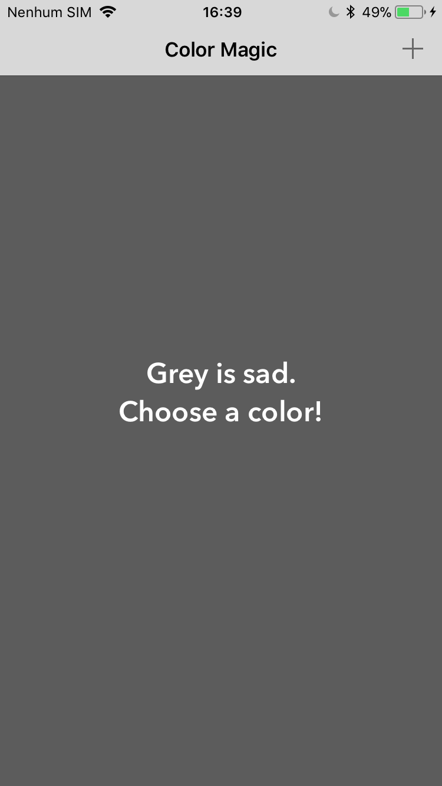
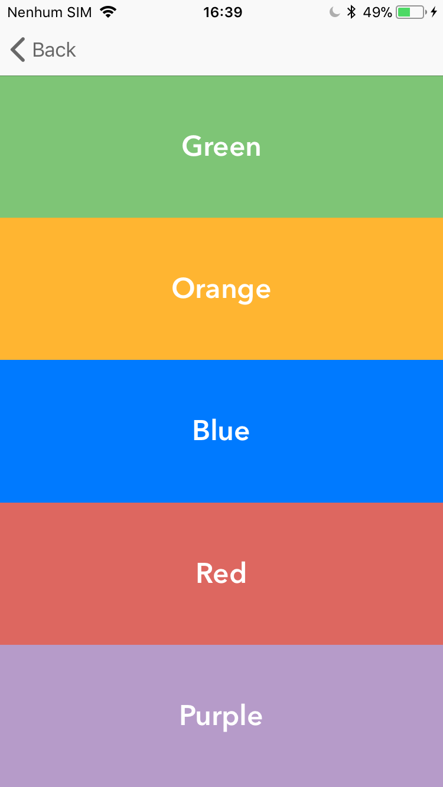

# protocol-delegate-sample

Aplicação de referência, cujo objetivo é exemplificar o uso de Protocol e Delegate em Swift. 

## Resumo

Baixando este exemplo você vai encontrar o uso de:
 - Storyboard
 - Protocol
 - Delegate
 - UIButton
 - UIStoryboardSegue
 - UIColor

## Screenshots

.")
.")
.")
.")
.")

## Construído utilizando

* [Xcode 8](https://developer.apple.com/xcode) - IDE de desenvolvimento.

## Autor

* **João Carlos Brandão Morgado** - *Trabalho Inicial* - [joaobrandao](https://github.com/jocabrandao)

## Licença

MIT 